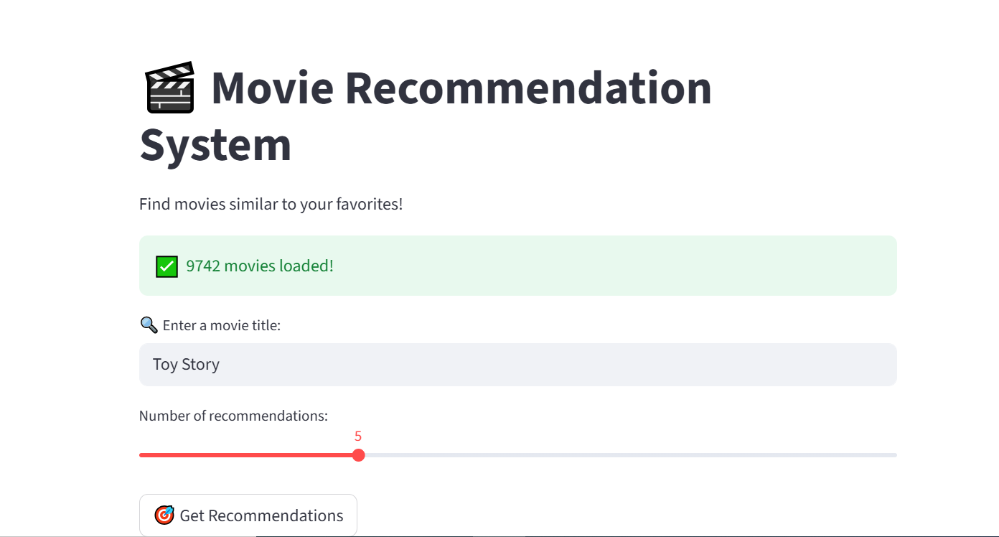
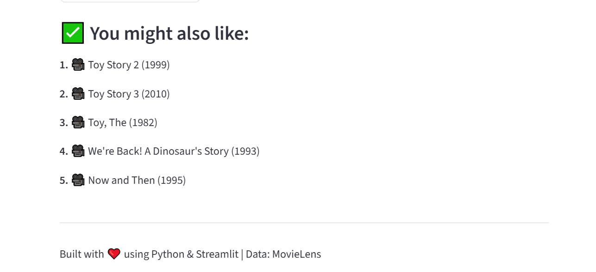

# 🎬 Movie Recommendation System

A content-based movie recommendation system built with Python, scikit-learn, and Streamlit. Enter any movie title and get 5 similar movie recommendations instantly!

---

## 🚀 Live Demo

🌐 [Click here to try the app](https://movie-recommender-c5szhvcuhmqtqfn26xfcbm.streamlit.app)

---

## 📌 Features

- 🔍 Search any movie by title (partial match supported)
- 🎯 Get top N similar movie recommendations
- 📊 Content-based filtering using TF-IDF + Cosine Similarity
- 🌐 Interactive web UI built with Streamlit
- 🗂️ Powered by MovieLens dataset with 9,742 movies

---

## 🛠️ Tech Stack

| Tool | Purpose |
|---|---|
| Python | Core programming language |
| pandas | Data loading and processing |
| scikit-learn | TF-IDF Vectorizer + Cosine Similarity |
| Streamlit | Web application UI |
| MovieLens Dataset | Movie data (9,742 movies) |

---

## 📂 Project Structure

```
movie-recommender/
├── data/
│   └── movies.csv          # MovieLens dataset
├── src/
│   ├── __init__.py
│   ├── data_loader.py       # Load and preprocess data
│   └── recommender.py       # TF-IDF recommendation engine
├── app.py                   # CLI application
├── streamlit_app.py         # Streamlit web app
├── requirements.txt         # Python dependencies
└── README.md
```

---

## ⚙️ How It Works

1. **Data Loading** — Loads `movies.csv` from MovieLens dataset
2. **Feature Extraction** — Combines movie title + genres into a text feature
3. **TF-IDF Vectorization** — Converts text features into numerical vectors
4. **Cosine Similarity** — Measures similarity between all movie vectors
5. **Recommendation** — Returns the top N most similar movies

---

## 🖥️ Run Locally

### 1. Clone the repository
```bash
git clone https://github.com/juttigaharshitha7/movie-recommender.git
cd movie-recommender
```

### 2. Install dependencies
```bash
pip install -r requirements.txt
```

### 3. Run CLI app
```bash
python app.py
```

### 4. Run Web app
```bash
streamlit run streamlit_app.py
```

---

## 📦 Requirements

```
pandas
numpy
scikit-learn
scipy
streamlit
```

Install all with:
```bash
pip install -r requirements.txt
```

---

## 📊 Dataset

This project uses the [MovieLens Small Dataset](https://grouplens.org/datasets/movielens/) by GroupLens Research.

- 9,742 movies
- Genres and titles used as features

---

## 📸 Screenshots

### 🔍 Search Page


### ✅ Results Page


> 🎬 Movie Recommendation System Web App
> - Enter a movie title (e.g. Toy Story, Jumanji)
> - Adjust number of recommendations (3–10)
> - Click "Get Recommendations"

---

## 👩‍💻 Author

**Juttiga Harshitha**
- GitHub: [@juttigaharshitha7](https://github.com/juttigaharshitha7)

---

## 📄 License

This project is open source and available under the [MIT License](LICENSE).

---

*Built with ❤️ using Python & Streamlit | Data: MovieLens*
